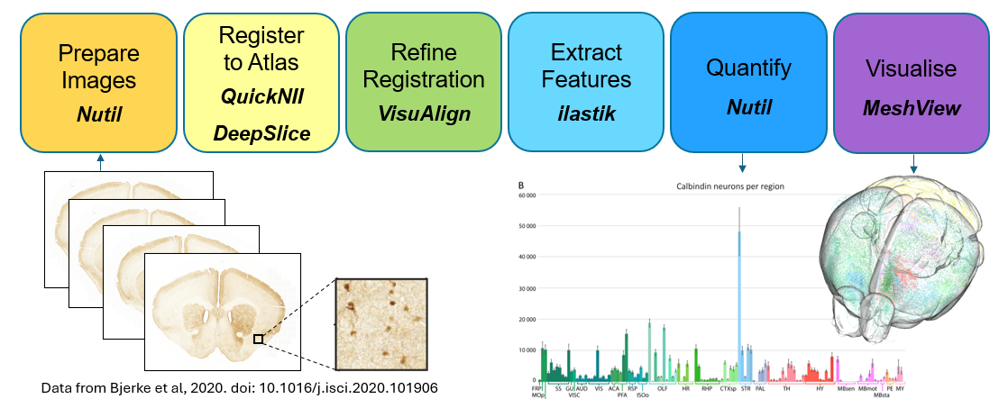

**What is the QUINT workflow?**
=================================

The QUINT workflow is an analysis solution for 2D rodent brain microscopy data, enabling brain-wide mapping and regional quantification using a reference brain atlas. The workflow is used to quantify cells and establish maps of cell distribution, receptor densities, connectivity patterns or pathological protein accumulation in the brain. It combines the use of a series of standalone desktop applications with graphical user interfaces (GUI), no coding ability required. 

.. tip::   
   **Visit** `EBRAINS <https://ebrains.eu/service/quint/>`_ **for more information about QUINT.**
 
**Which atlases are supported?**
-----------------------------------

* Allen Mouse Brain Atlas Common Coordinate Framework version 3 (CCFv3) (delineations from 2017 or 2015).
* Waxholm Atlas of the Spraque Dawley Rat (WHS) (version 2, 3 and 4).
* Kim Unified Adult Mouse Brain Atlas (version 1, 2019).
* Developmental Mouse Brain Atlas for ages P4-P56 (DeMBA) with Allen CCFv3 delineations from 2017.
* Developmental Mouse Brain Atlas for ages P4-P56 (DeMBA) with Kim Lab developmental delineations (KimLabDev CCFv001).
* Some other atlases have been made available in our tools by external users (contact us at EBRAINS support to find out more).

**What is the output of the QUINT workflow?**
-----------------------------------------------

The QUINT workflow takes brain section image series as input, and generates counts of labelled objects, area fraction per atlas-region, and coordinates for visualising objects in 3D atlas space.

**How to access the QUINT workflow?**   
======================================

The QUINT workflow involves defined steps using several desktop applications. The desktop applications are available for download at `NITRC.org <https://www.nitrc.org>`_, with direct download links provided on the pages for each tool.

.. tip::   
   An online version of the QUINT workflow, accessible through the EBRAINS research infrastructure, is under development. This will provide tighter integration of the tools and new features such as shareable microscopy viewer links and automated plotting. If you are interested in testing and giving feedback on an alpha version on the QUINT online workflow, please get in touch.

Steps in the QUINT workflow:

1. **Prepare section images** for analysis using *Nutil* or another image editing tool (rename the files to meet the QUINT naming convention and downscale the images).
2. **Register the section images to An atlas**. Linear registration is performed using *QuickNII*, *VisuAlign* supports refining the registration using non-linear methods. For coronal mouse brain sections, *DeepSlice* (a web-application) can automate the linear registration step.  
3. **Extract features** to be quantified using *ilastik* or another image analysis tool such as *NIH ImageJ* or *QuPath*. 
4. **Quantify features** in atlas regions using *Nutil*.
5. **Perform quality control** steps with *QCAlign* (optional). This allows checks for tissue damage and quality control of the atlas-registration to the sections. It enables exploration of the atlas hierarchy and creation of customised compilations of regions to use for Nutil quantification.
6. **Visualise** the results in 3D atlas space using the online *MeshView* Atlas Viewer.

**Learn more**
================

**Watch our video tutorials**
---------------------------------

.. raw:: html

   <iframe width="560" height="315" src="https://www.youtube.com/embed/n-gQigcGMJ0" title="YouTube video player" frameborder="0" allow="accelerometer; autoplay; clipboard-write; encrypted-media; gyroscope; picture-in-picture" allowfullscreen></iframe>

For in-depth tutorials on how to use the software in the QUINT workflow, check out our `online course <https://training.incf.org/course/neuroscience-data-integration-through-use-digital-brain-atlases>`_ available through the INCF training space (parts 7-11). 

**Examples of use**
----------------------------------

QUINT is suited for sections from mouse and rat brain that have been labelled to reveal features. It works for sections cut at any angle of orientation, for complete and partial brain sections, and for sections affected by distortion and damage. It can be used for:

* Cell count analysis
* To spatially characterise pathology
* Analyse tract tracing connections
* Analyse tissue clearing data captured by light sheet microscopy

**Check out the following articles that have used QUINT:**

* Correia A et al. Cellular prion protein acts as mediator of amyloid beta uptake by caveolin-1 causing cellular dysfunctions in vitro and in vivo. Alzheimers Dement. 2024 Aug 30. http://doi.org/10.1002/alz.14120

* Lubben N et al. LRRK2 kinase inhibition reverses G2019S mutation-dependent effects on tau pathology progression. Translational Neurodegeneration. March 2024. http://doi.org/10.1186/s40035-024-00403-2

* Geertsma et al. A topographical atlas of alpha-Synuclein dosage and cell-type expression in the adult mouse brain and peripheral organs. npj. March 2024. https://doi.org/10.1038/s41531-024-00672-8

* Koen Seignette, Nora Jamann, Paolo Papale, Huub Terra, Ralph O Porneso, Leander de Kraker, Chris van der Togt, Maaike van der Aa, Paul Neering, Emma Ruimschotel, Pieter R Roelfsema, Jorrit S Montijn, Matthew W Self, Maarten HP Kole, Christiaan N Levelt. Jan 2024. Experience shapes chandelier cell function and structure in the visual cortex eLife 12:RP91153. https://doi.org/10.7554/eLife.91153.3  

* Guardamagna M, Chadney O, Stella F, Zhang Q, Kentros C, Battaglia F. Direct Entorhinal Control of CA1 Temporal Coding. bioRxiv. May 2023; doi: https://doi.org/10.1101/2023.05.27.542579 

* Goralski T et al. Spatial transcriptomics reveals molecular dysfunction associated with Lewy pathology. BioRxiv. May 2023. https://doi.org/10.1101/2023.05.17.541144 

* Zhang G, Xia S, Zhang N, Gao F, Zlokovik B, Zhang L, Zhao Z, Tao H. Integrative mapping of spatial transcriptomic and amyloid pathology in Alzheimer's disease at single-cell resolution. Preprint. May 2023. https://doi.org/10.1101/2023.05.07.539389 

* Gurdon B, Yates SC, Csucs G, Groeneboom N, Hadad N, Telpoukhovskaia M, Oullette A, Oullette T, O'Connell K, Singh S, Murdy T, Merchant E, Bjerke I, Kleven H, Schlegel U, Leergaard T, Puchades M, Bjaalie J, Kaczorowski C. Detecting the effect of genetic diversity on brain composition in an Alzheimer's disease mouse model. BioRxiv. Feb 2023. https://doi.org/10.1101/2023.02.27.530226
 
* Hug NF, Lindsay NM, McCallum WM, Bryan J, Huang K, Ochadarena N, Tassou A, Scherrer G. Opioid receptor architecture for the modulation of brainstem functions. 2022 Dec. BioRxiv. https://doi.org/10.1101/2022.12.24.521865 

* Lopes MM, Paysan J, Rino J, Lopes SM, Pereira de Almeida L, Cortes L, Nobre RJ. A new protocol for whole-brain biodistribution analysis of AAVs by tissue clearing, light-sheet microscopy and semi-automated spatial quantification. Gene Ther. 2022 Nov 1. https://doi.org/10.1038/s41434-022-00372-z.

* Jo Y, Lee SM, Jung T, Park G, Lee C, Im GH, Lee S, Park JS, Oh C, Kook G, Kim H, Kim S, Lee BC, Suh GSB, Kim SG, Kim J, Lee HJ. General-Purpose Ultrasound Neuromodulation System for Chronic, Closed-Loop Preclinical Studies in Freely Behaving Rodents. Adv Sci (Weinh). 2022 Oct 19:e2202345. https://doi.org/10.1002/advs.202202345 

* Botros P, Vendrell-Llopis N, Costa R, Carmena J. A neural model of proximity to reward. 2022 Oct. BioRxiv 2022.10.03.510669. https://doi.org/10.1101/2022.10.03.510669 

* Yao Y, Barger Z, Saffari Doost M, Tso CF, Darmohray D, Silverman D, Liu D, Ma C, Cetin A, Yao S, Zeng H, Dan Y. Cardiovascular baroreflex circuit moonlights in sleep control. Neuron. 2022 Sep 23:S0896-6273(22)00802-9. https://doi.org/10.1016/j.neuron.2022.08.027.

* Ham GX, Augustine GJ. Topologically Organized Networks in the Claustrum Reflect Functional Modularization. Frontiers in Neuroanatomy. 16 June 2022. https://doi.org/10.3389/fnana.2022.901807 

* Bjerke IE, Cullity ER, Kjelsberg K, Charan KM, Leergaard TB, Kim JH. DOPAMAP, high-resolution images of dopamine 1 and 2 receptor expression in developing and adult mouse brains. Sci Data. 2022 Apr 19;9(1):175. https://doi.org/10.1038/s41597-022-01268-8

* Telpoukhovskaia MA et al. Conserved cell-type specific signature of resilience to Alzheimer’s disease nominates role for excitatory cortical neurons. bioRxiv; doi: https://doi.org/10.1101/2022.04.12.487877

* Tocco C, Øvsthus M, Bjaalie J.G, Leergaard T.B and Studer M. The topography of corticopontine projections is controlled by postmitotic expression of the area-mapping gene Nr2f1. Development; 149 (5). 2022. https://doi.org/10.1242/dev.200026

* Kim S, Jo Y, Kook G, Pasquinelli C, Kim H, Kim K, Hoe HS, Choe Y, Rhim H, Thielscher A, Kim J, Lee HJ. Transcranial focused ultrasound stimulation with high spatial resolution. Brain Stimul. 2021 Mar-Apr;14(2):290-300. https://doi.org/10.1016/j.brs.2021.01.002
   
* Whilden CM, Chevée M, An Seong Yeol,  Pezon Brown S. The synaptic inputs and thalamic projections of two classes of layer 6 corticothalamic neurons in primary somatosensory cortex of the mouse. J Comp Neurol. 2021 Dec;529(17):3751-3771. doi: https://doi.org/10.1002/cne.25163. Epub 2021 May 6. 
   
* McDonald MW, Jeffers MS, Filadelfi M, Vicencio A, Heidenreich G, Wu J and Silasi G. Localizing Microemboli within the Rodent Brain through Block-Face Imaging and Atlas Registration. eNeuro 16 July 2021, 8 (4) ENEURO.0216-21.2021; DOI: https://doi.org/10.1523/ENEURO.0216-21.2021    
   
* Bjerke IE, Yates SC, Laja A, Witter MP, Puchades MA, Bjaalie JG and Leergaard TB. Densities and numbers of calbindin and parvalbumin positive neurons across the rat and mouse brain. 2021, iScience.https://doi.org/10.1016/j.isci.2020.101906

**FAQ**
------

You can find FAQ for each software here:

`QuickNII FAQ <https://quicknii.readthedocs.io/en/latest/FAQ.html>`_

`VisuAlign FAQ <https://visualign.readthedocs.io/en/latest/FAQ.html>`_

`Ilastik FAQ <https://quint-workflow.readthedocs.io/en/latest/Ilastik.html#faq-and-troubleshooting/>`_

`Nutil FAQ <https://nutil.readthedocs.io/en/latest/FAQ.html>`_

