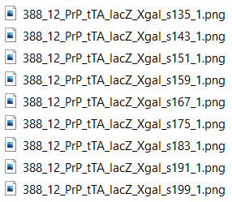

**Preparing the images**
==========================

All the software in the QUINT workflow have file input requirements:

* The file naming convention applies to all the software. It is recommended to change the file names as the first step in the QUINT workflow. This ensures that the files are compatible with QuickNII and VisuAlign, and that the output files of *QuickNII*, *VisuAlign* and *ilastik* are directly compatible with *Nutil*. 
* As the image size requirements for `QuickNII <https://quicknii.readthedocs.io/en/latest/imageprepro.html>`_ and `Ilastik <https://quint-workflow.readthedocs.io/en/latest/Ilastik.html#preparing-images-for-ilastik>`_ differ, it is recommended to generate two series that comply with their respective requirements. 

.. tip::
   The *Nutil* software can be used to prepare the images since it supports image transformations (downscaling, rotation, mirroring), renaming of files and file format conversion. Alternative software such as *FIJI* or *Adobe Photoshop* can also be used.

**QUINT naming convention**
-------------------------------

* Add a unique ID to each image that reflects the serial order and spacing of the sections. 
* The format is: _sXXX with XXX representing the section number (not restricted to three digits). 

For example, for consecutive sections: _s0001, _s0002, _s0003

.. tip::
   The Quantifier feature in *Nutil* uses the _sXXX naming convention to match up corresponding atlas maps, segmentations and registration information. While not recommended, it is possible to bypass the naming convention as long as there is a consistent naming convention across the files. In this case, define the naming convention in *Nutil* using Regular Expressions (RegExp). For more information see the “Help” button in the *Nutil* GUI or contact user support.

